# Low-cost DO oxygen sensor from SEEED Studio, Senscap

This project starts with a first objective: to interface a SEEED studio low-cost oxygen probe and verify its metrologic specs. It means calibrate the probe and check its performances regarding the manufacturer specs and a referenc
optode on at least 3 levels: 0% stauration O2, 50% and 100%.

- First step is to interface this RS485 probe to a computer and get decent data
- Post-it for connecting probe cables on UART gravity module DFR0845
* Probe red cable: 12V
* Probe black cable : GND
* Probe blue cable : A
* Probe withe cable : B
  
## 12/12/202, problem found bad DO reading output in arduino serial monitor
This the problem we face:
We first test the code Oxigeno_LowCost_G1_RTC_V1.ino provided that comes from our mexican friends and collects the temperature and dissolved oxygen.
We have commented the parts concerning the timing of the data and the saving on SD card.
However it remains a problem as the oxygen values are not correct. This is a reading with 115200 baud rate

```
Temperatura: 17.20;
Oxigeno: 0.01;
Temperatura: 17.20;
Oxigeno: 0.02;
```
This is the first problem to fix.


## 13/12/2024, understanding the CRC code ending a modbus command and managing to generate it (not useful at the moment) 
We are now able to produce the CRC code (hex) ending a modbus command line. It is a 4 digits code XX XX in hexadecimal with low-byte first. It is done thanks to the python code provided by chatgpt.

To do: ligne 113 du code tester l'interrogation de nouvelles adresses de registres pour voir ce que ça donne 
  result = node.readHoldingRegisters(0x0000,4);
  changer l'adresse 0x0000 avec d'autres adresses pour comprendre comment marche la fonction getResponseBuffer

  ### extrait du code de la librairy
  https://github.com/jecrespo/RS485_Modbus_Arduino/blob/master/ModBusMaster485/ModbusMaster485.h#L104

  ```
  @ingroup constant
    */
    static const uint8_t ku8MBInvalidCRC                 = 0xE3;
    
    uint16_t getResponseBuffer(uint8_t);
    void     clearResponseBuffer();
    uint8_t  setTransmitBuffer(uint8_t, uint16_t);
    void     clearTransmitBuffer();
  ```

 ## 16/12/2024, talking to your device with linux and mbpoll cmd lines (free soft)
**To be able to communicate via the PC and windows to the probe, you must load the passerail.ino code on the device and then open modbus tester program to send commandes. Otherwise the port remains busy.** Today we managed to get a code on this page
http://4-20ma.io/ModbusMaster/examples_2_r_s485__half_duplex_2_r_s485__half_duplex_8ino-example.html#a7 
we then adapted it to adress 0x0000 of the probe and the register 0x02 for T°C and 0x03 for the DO. DO values remain 0.01 and perhaps this is due to a bad calibration. We will try to sort that out.
Connecting the probe and receiving data using modbus protocol and linux machine. Use mbpoll tool and run the following command as a first test:
  ```console
  mbpoll -a 55 -b 9600 -t 4 -r 3 -c 1 -d 8 -P none /dev/ttyUSB0;
  ```
  Careful: run 
  ```console
  lsusb
  sudo dmesg | grep tty
  ```
  This will help you identify to witch usb port your device is connected on your computer

 Explanation of Each Parameter (extract from Chatgpt)
 ```
    -a 55: Sets the Modbus slave address to 55.
    -b 9600: Sets the baud rate to 9600.
    -t 2: Specifies holding registers (Modbus function code 03). Change this if accessing a different register type:
        -t 3: Input registers (function code 04).
        -t 1: Coil (discrete outputs).
        -t 0: Discrete input.
    -r 3: Start reading from register address 3.
    -c 1: Read 1 register.
    -d 8: Sets data bits to 8.
    -P none: No parity.
    /dev/ttyUSB0: Specifies the serial port.
```

## 17/12/2024, mbpoll getting reading single register, device ID successfull
If you want to get the ID number of your device which accordinf to the manual is at the adress 0x2000 (42001), first step is to convert 0x2000 form hexadcimal to decimal:
that gives 8192dec.
Then use this command 
```console
mbpoll -a 55 -m rtu -b 9600 -d 8 -s 1 -P none -o 1 -r 8192 -0 -t 4 /dev/ttyUSB0
```

## 19/12/2024, modbustester succeed to write to register. Modbus poll.exe helps finfind the register list, calibration achieved in T and DO
Success: We have managed to send a modbus command to change the device ID with modbustester.exe. 
Modbus Poll soft for windows is interesting to see the hexadecimal command sent but we have not managed to send any command with this soft. No Rx message is visible in the communication window.
Be careful, you must write the address of the buffer you want to read/write in decimal format in modbus-tester.

Insert image here

Today, we also managed to identify the list of addresses available using the scan addresses tool from modbus poll soft. 
We also managed to calibrate the temperature sensor using modbus tester and sending 172 to address 0x1000 which means force the temp sensor to 17.2 °C.
We also managed to calibrate the DO sensor doing the slope protocol. 
- First immerse the probe 10 cm away from the bottom in a 1L beaker filled with tap water + sodium sulphite anhydrous to kill all dissolved oxygen an then send value 0 to address 0x1001.
- Second step **(order of steps is important)**, immerse the probre 10 cm away from bottom in becher filled with tap water and perform a 100% calibration by sending 0 to address 0x1003.
**Finally, the DO values outputted in arduino serial monitor remain at 0.01 which is not satisfying. We must dig into that. We suspect a dysfunctionning of the DO readings of the probe. To be examinated after the holidays.**

## 20/12/2024, trying to install node-red to read data from modbus device
I got help from RTCE forum regarding this task.
Check the topic here: https://rtce.forum.inrae.fr/t/communication-rs485-modbus-rtu-seeed-studio-dissolved-oxygen-probe/319/4?u=poirier_etienne1
Emmanuel Landrivon recommends using node-red (open-source) to communicate with the DO Probe through a USB<->RS485 adapter. Node-red is a tool to produce code via a graphic interface. Supposed to be easier for beginners like me. So I will try using node red to read/write the buffers of my DO Probe.
Eventually I will interface my device via node red to an ESP32 firebeetle via Tasmota (+ module RS485) :https://tasmota.github.io/docs/Modbus-Bridge/
So that's the plan, let's dive into it:

###Installing node red on linux/debian/ubuntu:
- First install nvm (Node version manager). nvm is a tool that can help manage Node.js installations.
  Check this page: https://nodejs.org/en/download/package-manager/
  
```Bash
# installs nvm (Node Version Manager). 
curl -o- https://raw.githubusercontent.com/nvm-sh/nvm/v0.40.1/install.sh | bash

# download and install Node.js (you may need to restart the terminal)
nvm install 22

# verifies the right Node.js version is in the environment
node -v # should print `v22.12.0`

# verifies the right npm version is in the environment
npm -v # should print `10.9.0`
```
Don't forget now to source the bashrc file to be able to activate nvm command

```Bash
source /home/epoirier/.bashrc
```
The previous installation of nvw installed v12 version which is not enough. Upgrade to nvm v18 version (at least, v20 available too) to be able to run node red.

```Bash
nvm install v18
```
You are now goo to run node red command:
```Bash
node-red
```
If at this step, it says ''node-red function nor found'', it means perhaps that you did not have npm and nvm installed, so check that they are installed and run again the code block ''Installing node red on linux/debian/ubuntu:''

1. Verify Node.js Installation

Node-RED depends on Node.js. Check if Node.js is installed and its version:
```Bash
node -v
```
If you see an error or the version is below the required version (typically Node.js 14.x or higher), you’ll need to install or update Node.js.

Install Node.js (Latest LTS version):
```Bash
curl -fsSL https://deb.nodesource.com/setup_lts.x | sudo -E bash -
sudo apt-get install -y nodejs
```

Verify npm:
```Bash
npm -v
```

If npm is missing, install it:
```Bash
sudo apt install npm
```

2. Install Node-RED

Once Node.js and npm are set up, install Node-RED globally using npm:
```Bash
sudo npm install -g --unsafe-perm node-red
```

Check if Node-RED was installed:
```Bash
node-red -v
```

Your node red is now running in your terminal.
Supposing that your are working locally on your laptop for this first test, go to your web browser and type http://localhost:1880 to access the node red editor.
You will get this page in your web browser.


However, if you miss the modbus command function on the left panel. Quit Node-RED and execute this command in your terminal:
```Bash
npm install node-red-contrib-modbus
```
Check the page for modbus package installation in Node-red: https://flows.nodered.org/node/node-red-contrib-modbus
Start again your node-RED and begin creating your first flow.
It seems that the modbus nodes don't show up in the Palette. So on your web interface go to Manage Palette/Palette/Install
and choose: node-red-contrib-modbus
Check this page for more details: https://flowfuse.com/node-red/protocol/modbus/


Please check-out this page regarding node red and nvm installation on linux debian: 
https://nodered.org/docs/getting-started/local
https://nodered.org/docs/faq/node-versions

## 07/01/2025, node-red working to read data from the sensor

Working on node-red the 20/12/2024, 06/01 and 07/01/2025, I managed to get it working on my laptop (running Ubuntu) and my desk computer running ubuntu too.
Below is the picture of my first flow (flux-1.json) to be found in the github files and user interface created with it.


However I had to face seberal problems which I will try to present her.

### Insert an image in node-red dashboard (or ui, standing for user interface)

If you want to insert an image in node-red dashboard as per the image of my probe, you must first do that:
```Bash
# go to the location of your node-red server
cd ~/.node-red
# create a public directory to put your images
mkdir ~/.node-red/public
# put your image in /public
cp mylocation/image.jpg ~/.node-red/public
# edit the settings.js file to tell node-red where you store your images
vim  ~/.node-red/settings.js
```
In this file settings.js, go to this line
```js
// httpStatic: '/home/nol/node-red-static/', //single static source
```
Add a new line below telling that your image will be in public
```js
httpStatic: require('path').join(__dirname, 'public'),
```
Restart node-red.

### Solving a cyclic dependency issue in Node.js

If for some reasons your nodes modbus read become stuck on waiting status. Also when running red-node on your console, you have this error message:
```bash
Error: Circular config node dependency detected: modbus-client
    at Flow.start (/usr/local/lib/node_modules/node-red/node_modules/@node-red/runtime/lib/flows/Flow.js:227:43)
```
You won't go anywhere else until you solve the issue on the modbus-client. My solution is to remove the old client and create a new one.

### Modbus reader node reconnecting (status yellow)

Don't use the same Poll rate for each modbus read node. It may create a connection issue to poll data at the same time. Choose diffrent rates such as 1s, 2s, 3s, etc...

## 07/01/2025, node-red flow2 finished. Looking good

I managed to finish flow 2 integrating the write registers nodes to be able to calibrate the probe.
I have done a gross calibration and well try now to test the accuracy of the probe.
Flow 2 is to be found under node-red folder and is nammed flow2-do_probe.json.


## 09/01/2025, meeting with jonathan flye sainte-marie

When showing him the node-red flow I realize that the temperature looks wrong: 23°C instead of 19°C expected.
Moreover the saturation of DO is 0.1% so wrong.
Instructions from Jonathan to continue the project are:
* validate or not the quality of the sensor in term of metrology. First get a fast response from the sensor. In fact node-red flow is very slow
at the moment. Perhaps I am not interrogating the right adresses. It takes time when calibrating the sensor temp for example and the DO value is not responding fast.
* for autonomous deployment. Plan is to integrate the sensor on OSO CTD P2I instead of the cond. sensor.
So the aim is to be able to interface the sensor with arduino and build a code for the OSO to work with the sensor.
Jonathan has bought a thread tap G3/4 to connect the sensor to a waterproof logger using à O ring seal.
the goal is to talk with it with a code on a ESP32.
* create a python library to talk with the sensor using python code. Building a library is new to me. There wuld functions as
  start DO, get DO, get temp, calDO,....

## 13/01/2025, calibration test in lab

### Problem to be solved on probe S/N 24000304
I tested the calibration of the current probe (I gave it the S/N 24000304, because of what I read at addresses 0x2004 and 0x2005). **But it does not accept the 100% saturated water cal. It gives 0.1% saturation instead.** Perhaps there is a x100 issue to solve??

### Calibration success on probe S/N 24100906
However I also tested the calibration using the same node-red flow on the new probe given by Jonathan. It works fine besides a few things:
* Response time very long on temeprature value (perhaps because the probe is not fully submerged. It takes 1-2 min for the sensor to converge to the true temperature. Offset corrected on tempertaure sensor is 0.2, 0.3°C. After a stabilization, probe temperature is near ref temperature +/- 0.1°C.
* We did a 100% saturated water cal on the new probe (S/N graved on probe housing: S/N24100906) and it worked fine
* we did then a 0% cal and it outputted 0.1% which is good.
* There was a mistake on mg/L DO value red in the node-red flow. We were reading the wrong address. It is solved now on flow 3.
* We managed in flow 3 to have all the modbus read nodes at 1s rate

  

### Increasing the data rate, logging the data
* modpoll tests output the data at 1s rate
* according to jonathan, mexicans managed to logged the data on sd card, they managed to get the data from the sensor at a best rate that what we get with the node-red interface
* An idea is to use modpoll command and python to talk to the sensor. Good, bad?
* An idea is to undersand correctly the modpoll commands to write and read in each register as they seem faster
* An idea is to abandon node-red and migrate to arduino to get better data rate, quicker sensor time response.

## 14/01/2025 Logging DO probe data with arduino
* managed to log temp, DO(mg/L), DO% in serial monitor and add timestamp but then I had to copy paste manually block by block to a text editor.
* In the same time I wrot down the DO values from WTW. Several test done in 0%, 100%, waters . Slope to be examined but huge offset already showing up.
* Global overview of the tests:

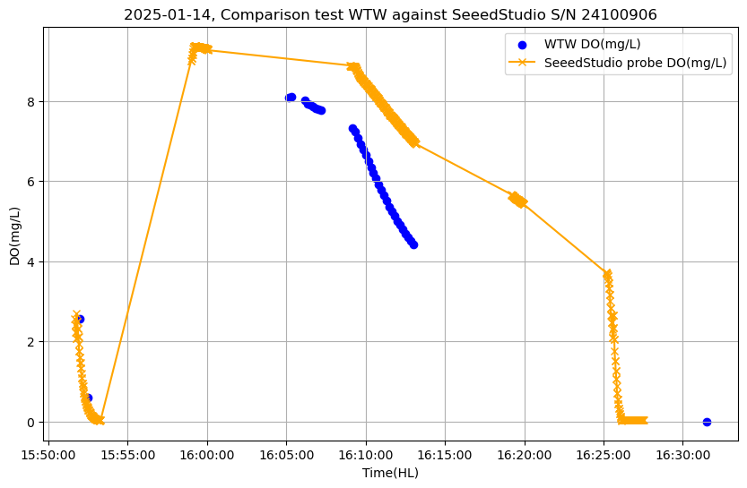
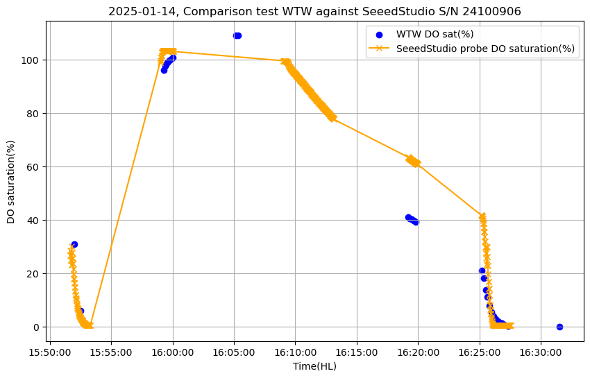


## 17/01/2025, Processing the data from DO Probe seeed studio versus WTW DO sensor

**Specs of the DO Probe SeeedStudio are:**
* Range DO [0-20.00] mg/L
* Precision DO +/-2% FS which means +/-0.4 mg/L
* Precision temperature +/- 0.3°C
* Resolution DO 0.01 mg/L
* Resolution temperature 0.1°C

Data files from WTW and Seeed studio probe to be found in comparison_test_14012025 folder
  
- First results regarding the performances of DO Probe Seeed Studio at stabilized levels:
  
    - Immersion of both probes is **100%** saturated/sursaturated water, stirred for 24hrs with magnetic stirrer

    **Averaged values observed on several minutes 2025/01/14, 15:15 HL:**
                 
    | In 100% sat water| WTW(ref) | SeeedStudio(instru) | Biais(instru-ref) | in Specs ?   |
    |------------------|----------|---------------------|-------------------|--------------|
    | Temperature (°C) | 21.0     | 21.0                | 0                 | Yes, <<0.3   |
    | DO (mg/l)        | 8.11     | 9.26                | +1.15             | **No, >0.4** |
    | DO sat (%)       | 109.1    | 103.9               | -5.2              | NC           |

    **Averaged values observed from 2025/01/14, 15:46:30 HL -> 15:49:19**:
                 
    | In 100% sat water| WTW(ref) | SeeedStudio(instru) | Biais(instru-ref) | in Specs     |
    |------------------|----------|---------------------|-------------------|--------------|
    | Temperature (°C) | 21.0     | 20.7                | -0.3              | Yes, = -0.3  |
    | DO (mg/l)        | 8.06     | 9.25                | +1.19             | **No, >0.4** |
    | DO sat (%)       | 108.7    | 103.2               | -5.5              | NC           |

    **Conclusion1: We observe that these values in 100% sat water are consistent. Biais on DO(mg/L) is have specs. In fact we rae in the middle of the range [0-20] which should give the best values. To be investigated...
    Records of temperature are ok. Saturation is affected as much as dissolved oxygen concentration.**

    - 2025/01/14, 15:18 HL immersion in **anoxic solution** prepared 24hr ago and left still
  
    **Stabilization for 2 minutes, below are values at 15:20 HL:**
       
    | In 0% sat water  | WTW(ref) | SeeedStudio(instru) | Biais(instru-ref) | in Specs ?   |
    |------------------|----------|---------------------|-------------------|--------------|
    | Temperature (°C) | 19.8     | 20.2                | +0.4              | **No >0.3**  |
    | DO (mg/l)        | 0.05     | 0.12                | +0.07             | Yes <0.4     |
    | DO sat (%)       | 1.1      | 2.0                 | +0.9              | NC           |

     **Stabilization at 16:31:30 HL, ending the experiment:**
  
    | In 0% sat water  | WTW(ref) | SeeedStudio(instru) | Biais(instru-ref) | in Specs ?   |
    |------------------|----------|---------------------|-------------------|--------------|
    | Temperature (°C) | 20.9     | 20.9                | 0                 | Yes << 0.3   |
    | DO (mg/l)        | 0        | 0.04                | +0.04             | Yes << 0.4   |
    | DO sat (%)       | 0        | 0.4                 | +0.4              | NC           |

    **Conclusion2: In anoxic water we logically observe a significant diminution of the biais comparing with saturated water. We are almost in the specs.**

  - Dynamic portions observed:
    
    - 2025-01-14;15:51:00 -> 15:53:20 ;probe immerged in 0 % sol, observing the decreasing of DO. Phase 1
        - 15:52:00 DO probe - DO WTW = -1.2 mg/L << -0.4mg/L (specs) => not good
        - 15:52:30 DO probe - DO WTW = -0.3 mg/L > -0.4mg/L (specs) = good
      **Concluison3: As we approach the 0% the diffrence probe - ref decreases as per the conclusion 2 above.
      Also in the decreasing part, we can identify doublets in the data showing that the sensor does not really output a new dataset every second.
      Perhaps this is due to the time stamping in arduino.**
          
      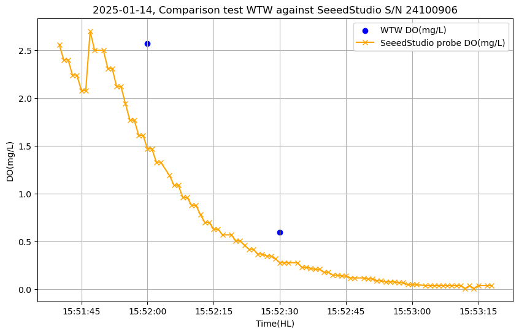
      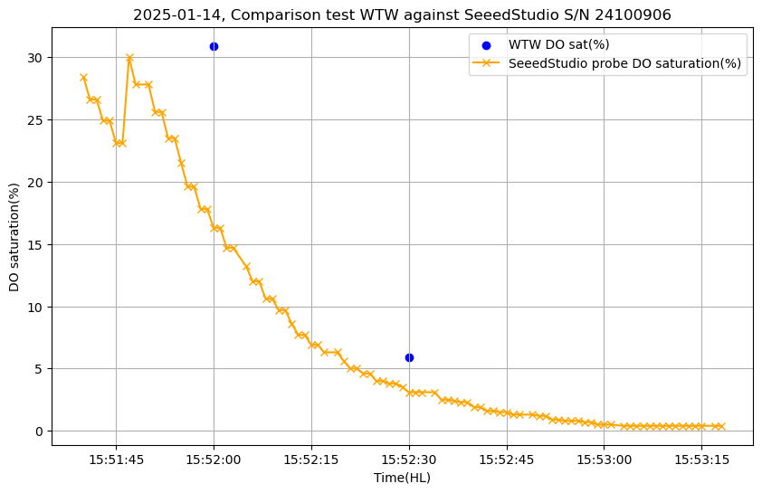
      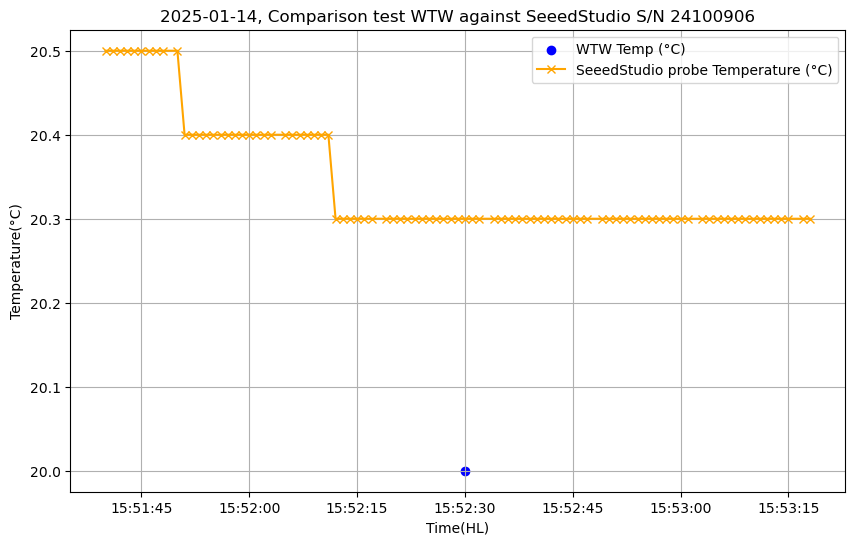 
      
    - 2025-01-14;15:59:19 -> 16:02:00 ;probe in 100 % sol, observing the increasing of DO. Phase 2
      **Conclusion4: Even if this is not very stable in terms of T°C and DO(mg/L), the DO concentration data are not noisy.
      No data were recorded for the WTW in DO concentration.
      However DO saturation data show a big biais in this portion. The SEEED probe seem to response faster.
      But that should not be the case regarding the high cost and quality of foils used on WTW probe. They should respond faster. Perhaps the SEEED probe respond too fast to the
      immersion in saturated water? There is to investigate on this portion.**
      
      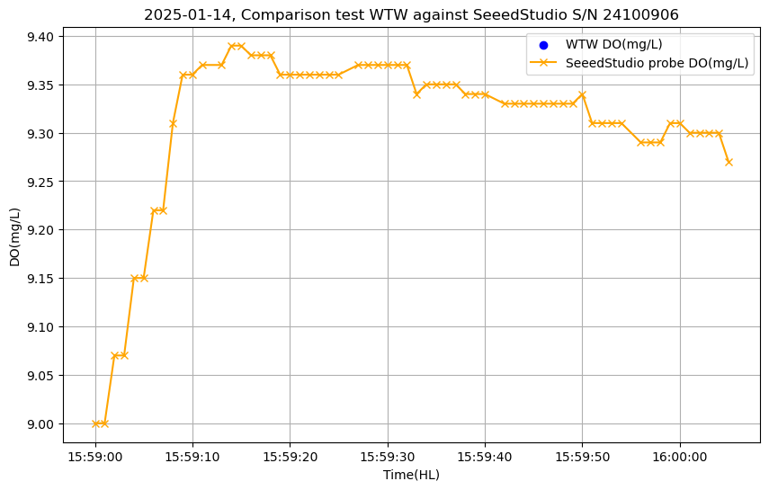
      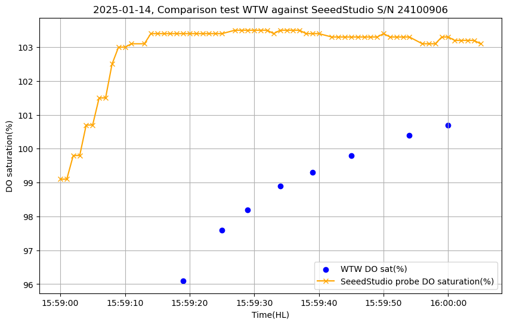
      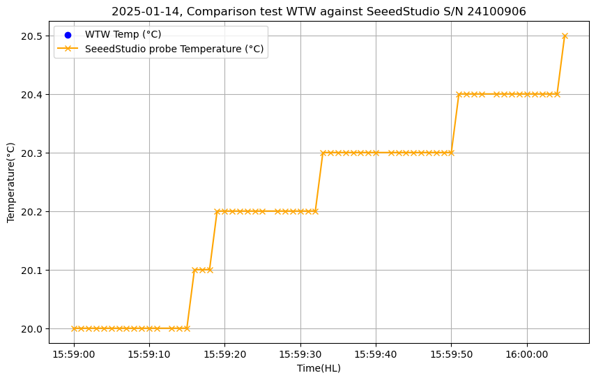 
      
    - 2025-01-14;16:05:30;added sulfite anhydre, little, no seeed probe data recorded, observing the decreasing of DO.
      Data written for WTW are before adding sulfite
      
      16:05:10 8.09 mg/L 109,1%
      16:05:20 8.11 mg/L 109,2%
      
    - 2025-01-14;16:09:00 -> 16:13 ;added sulfite anhydre, good spoon, observing the decreasing of D0, Phase 3
      **Conclusion4: The decreasing slope is diffrent between the two sensors. The biais increases with time and with DO concentration decreasing. Temperature is very stable.**
      
      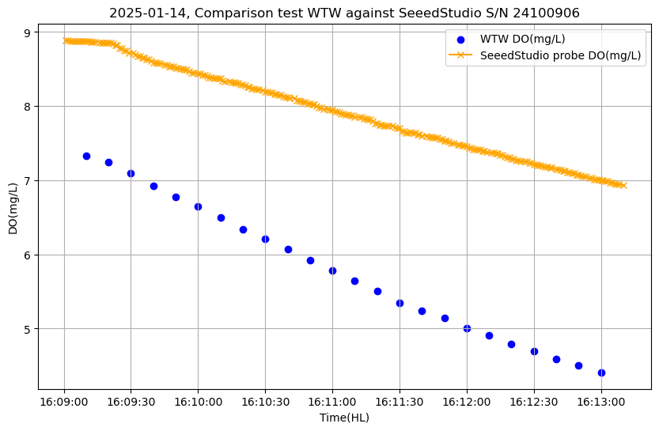
      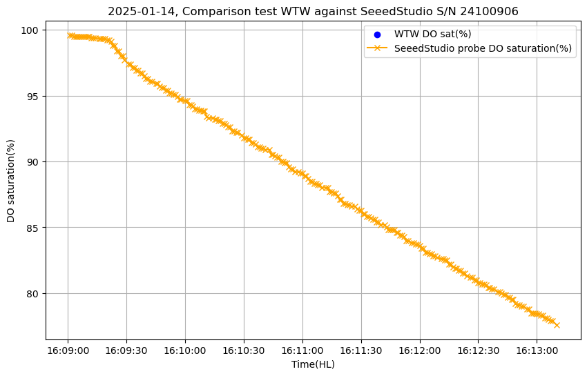
      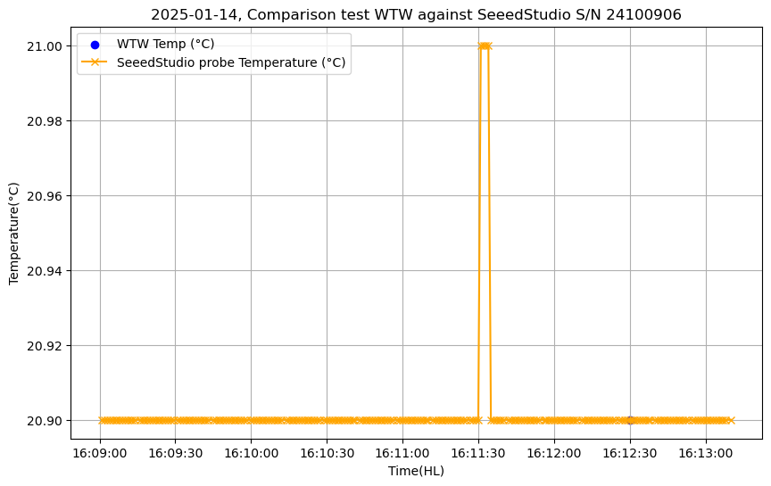
      
    - 2025-01-14; 16:19:10 -> 16:19:50, check point on 5 values, no DO(mg/L) values available for WTW, Phase 5
      **Conclusion5: We observe a stable temperature, a +22% offset (mes-ref) on DO sat %, 0.01mg/L / 2sec is the decreasing rate observed. There is a big difference between WTW DO and Seeed probe DO
      visible in the saturation but not represented in mg/L, could be calculated. That remains unsatisfying. Peggy Rimmelin-Maury(IUEM/CNRS) explained me that it could come from non homogenous water caused by the processus
      of disslovinng  suflite anhydre. She recommends using a propoer dissolved solution and mixe it with a 100% saturated one.**
      
      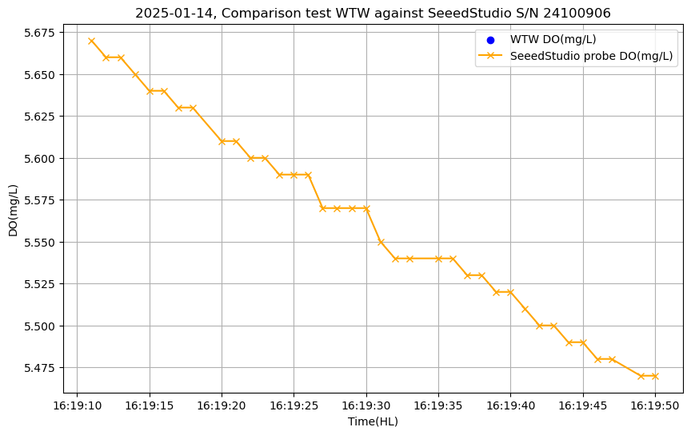
      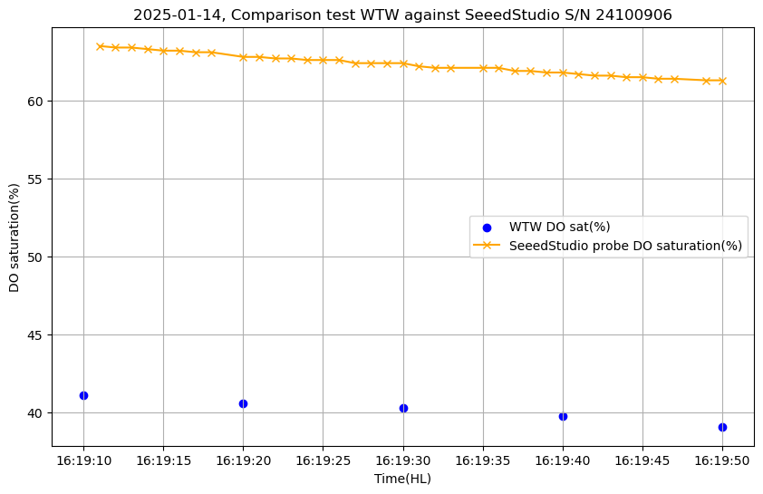
      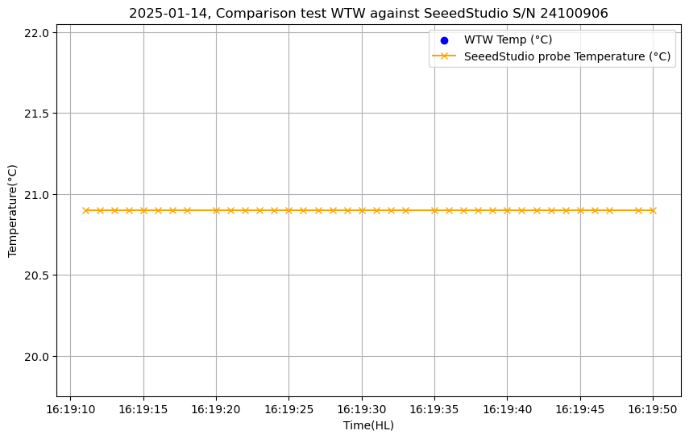
      
    - 2025-01-14;16:25:00;added sulfite anhydre, good spoon -> 16:31:30, reaching 0%, Phase 4
      **Conclusion6: We observe a stable temperature with unsignificant spikes (0.1°C). No DO concentration recorded by WTW. However sat graph show a convergence of the WTW data to 0% about 1min after the SEEED probe data.**
      
      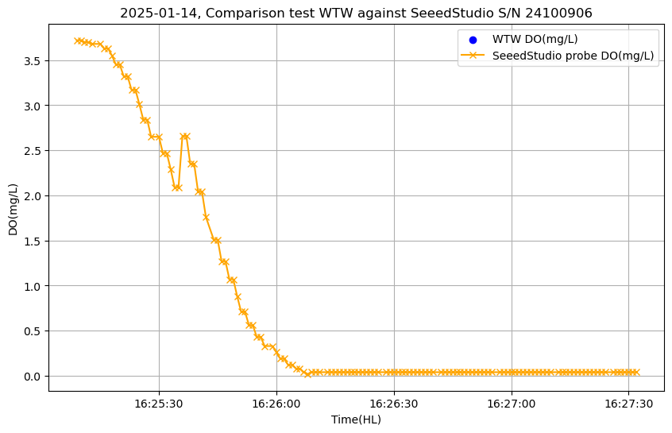
      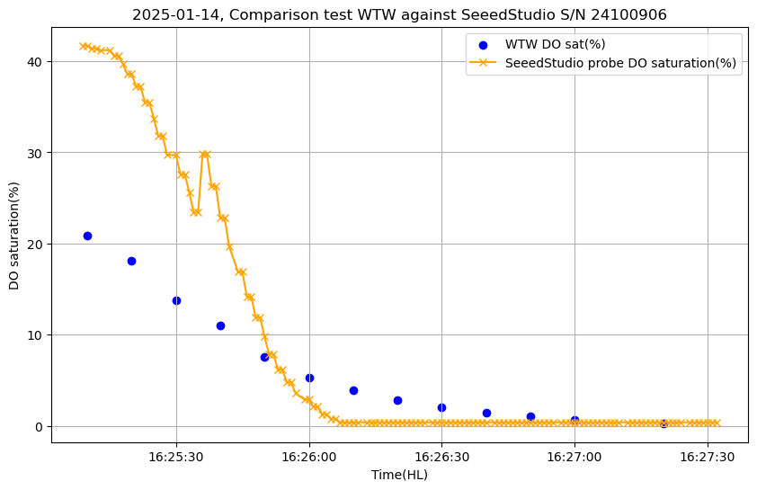
      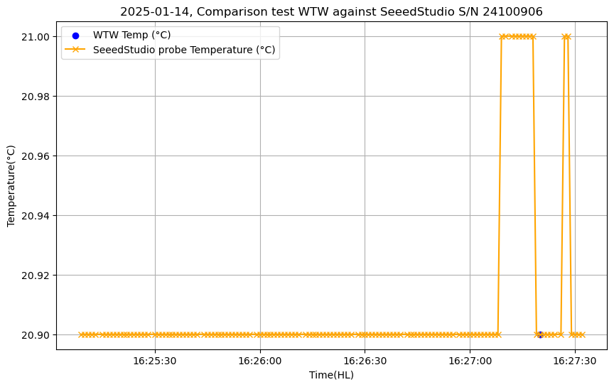

## 17/01/2025, Conclusion on the performances of Seeed Studio DO Probe
We assume that our calibrated WTW probe is our reference and is accurate.

Memo regarding metrology words:

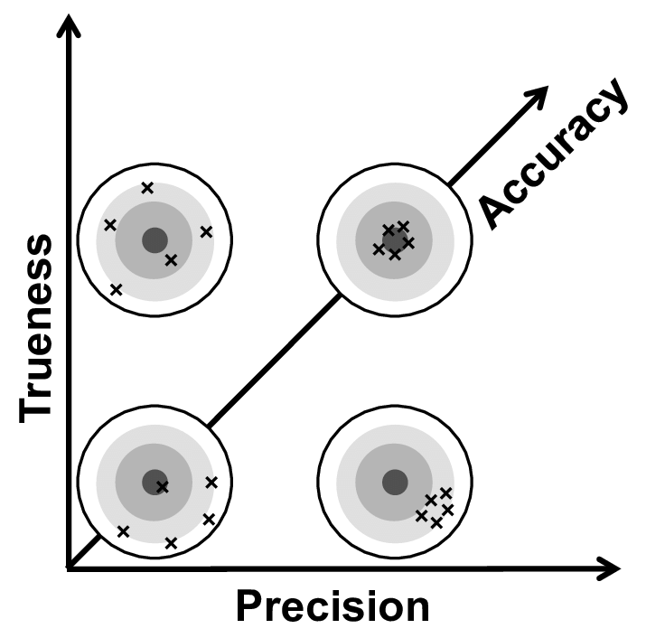

Range : We managed to check following sensor ranges: [19,21]°C, [0.01, 9.39]mg/L, [0.4, 103.5]%
**To be done: investigate < 19°C and > 21 °C temperatures and [9-20]mg/L DO concentrations**

All the results below are in respect with the above ranges explored.

Sensitivity/resolution: 
Sensor is able to measure DO rate of -0.01mg/L/2sec and +0.03mg/L/sec
Sensor resolution of +/- 0.1°C has been verified as well as O.O1 mg/L on DO.

Precision: DO probe data are precise in terms of temperature, DO concentration and saturation. We can say that as per the very low noise level observed.Conclusion5.

Trueness: 
Temperature data is true. It has been checked against mercure thermometer as well. However response time has not been tested and the full range neither.

* DO concentration data is not true in saturated water. It lies +1.17 mg/L >> 0.4 mg/L (specs) in saturated water. Check Conclusion1.
* DO concentration data is true in anoxic water. Check Conclusion2.
* DO concentration data is not true on > slopes. On increasing DO concentration, probe data comes faster to saturation that WTW ref data (Conclusion4). In fact we have 96% at the WTW when the probe is at 103.5%.
* DO concentration data is not true on < slopes. On decreasing DO concentration:
  At high concentration 85% avg: Conclusion 4 shows Mes >> Ref Biais = +2mg/L average. This biais increases.
  At mid-concentration 55% avg: Conclusion5 shows Mes >> Ref by +22% 
  At low concentration 15% avg: Conclusion3 shows Mes << Ref Mes = 15% and Ref = 30% Biais = -15% in the beginning of the record.

Accuracy:
**Sensor accuracy and response time on DO concentration has to be investigated further on intermediate concentration 30%, 60%.**

## 21/01/2025, New performances tests of Seeed Studio DO Probe

**It has been noticed by JFSM that on the above test of 14/01/2025, the WTW where compensated with salinity. That was true beacuse in the WTW logger a compensation of 35g/L salinity was applied. All tests from 14/01/2025 in DO concentration must be considered as false.**

On the 21/01/2025, new test where performed with no salinity compensation in the WTW logger. Better explanation of the experiment are to be found in the corresponding folder.

- First observation: do not use water straight from the tap. Better use relaxed water

- First phase is the saturation phase. We observe a low noise/dispersion on the seeed studio comparable with the WTW.
  Dispersion is around +/- 0.02mg/L

  

- During the desaturation phasis, this is what we observe. There is a delay between the two sensors. The SS probe reaches the 0% sat first.
- The step visible at 11:21 approx on the SS probe data is not explained
- The decreasing slope of the % sta is very straight on the SS probe. Looks less realistic that the WTW probe data.
  
 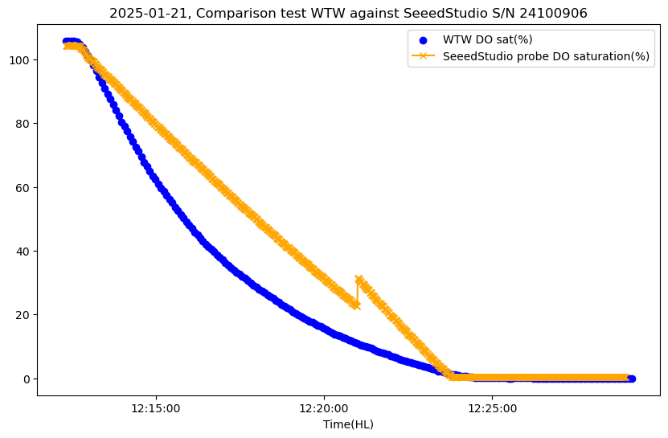

## 27/02/2025, experiment to characterize the sensor perfomances at diffrent % of saturation

**First step was to solve the problem of logging the data from the probe with a correct format:**
In fact the arduino script outputting the data + the python script to log them in a file was not satisfying. The format of the file could be red only with Vim and not the text editor and needed reformatting.
So the new solution is to log the data coming from the probe using minicom utility.
```Bash
sudo apt install minicom
minicom -b 9600 -D /dev/ttyUSB0
```
Then Ctrl+A to access minicom menu press L key and choose you file name to launch logging in a file
Ctrl+A Q to quit minicom


    
    

  


